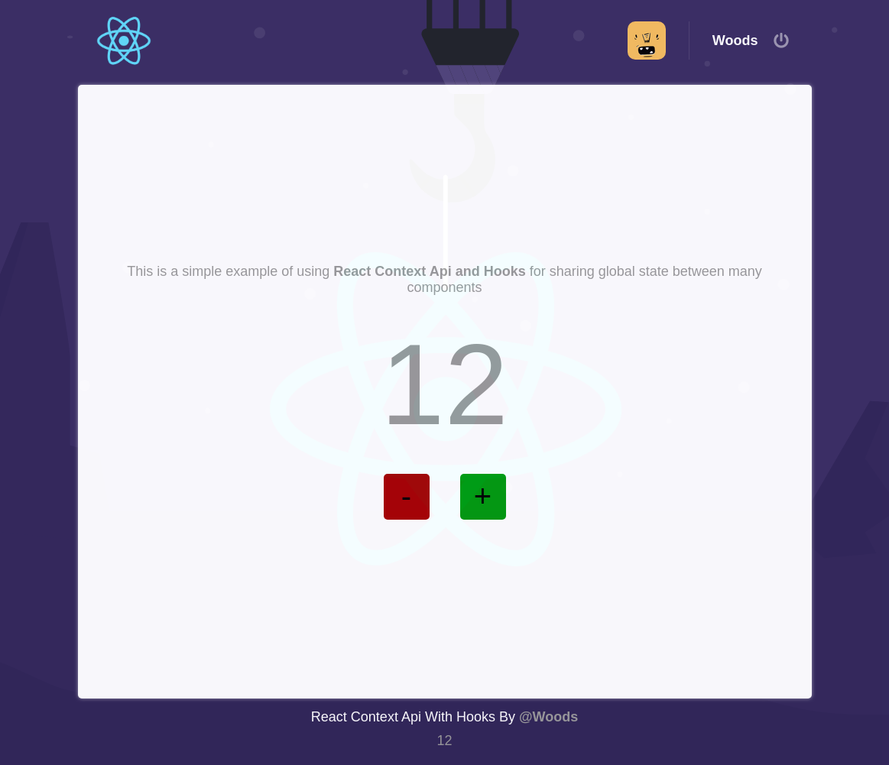

# React Context API

Simple example to using React Context Api to sharing the application state for many components.

**Multiple contexts support with only one root provider**

## How to run
- Clone this project in your computer
- Go to the folder you chose for this project
- In terminal, type `npm install` or `yarn` and press `enter`
- After installing all depencies, type `npm start` or `yarn start` 
- Success, your application should be running now 

## Checklist

- [x] Create a basic structure for project ( CRA )
- [x] Create a folder structure for project ( Custom )
- [x] Implement and configure Eslint, Prettier and Editor Config 
- [x] Add Plugins:

  - [x] React Router Dom
  - [x] React Icons
  - [x] React Toastify
  - [x] Styled Components
  - [x] History
  - [x] Prop-Types
  
- [x] Configure global styles ( Styled Components )
- [x] Create and configure application routes
- [x] Create pages and components:
  
   - [x] Login
   - [x] Home

- [x] Create services:

  - [x] api
  - [x] history
  - [x] storage (Context API)

- [x] Create and configures stores
  - [x] Auth
  - [x] Counter

- [x] Connect store provider to application

 ## Screens
 
 

 ## Live test
 https://lgct9.csb.app/
 
 ## License
 Distributed under the MIT license. See `LICENSE` form more information.